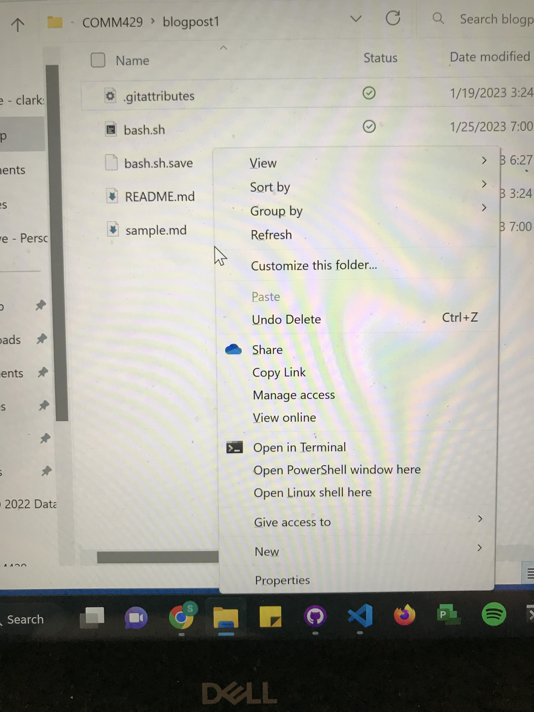

# Blog Post 1

The purpose for this blog was to write a command-line script that created a boilerplate for a project starter. This script will create a project folder with the personal file and folder setup I perfer inside that folder. It also provides some standard code in some files that appear in every project. 

To run this script you need to go to the blogpost1 directory with is below.
```
sebastiangeiger@DESKTOP-59SFL6R:/mnt/c/Users/sgeig/OneDrive - clarkson.edu/Desktop/8th Semester/COMM429/blogpost1$
```
Once you are in this directory you can run the script by opening the Linux Command Line.
you can do this by holding SHIFT and right clicking inside the folder. A menu should appear where you click the "Open Linux Shell Here" option.

Once the command line opens you can type the 
```
bash bash.sh
```
This will execute the script and set you up with your new project environment.

## Creating the Script and What it does
Below are the steps I took to create the script and what each part of the script does. Each part of the script has a purpose and all together it creates a good starting point for a new project environment. 

## 1. Set Directory

The first step for me was to set the directory I want my projects to go at the top of my script. I chose the folder I use for this class.
```
cd "/mnt/c/Users/sgeig/OneDrive - clarkson.edu/Desktop/8th Semester/COMM429"
```
I used quotes around the directory because of the spaces I have in my directory. The quotes prevent any errors occuring with the terminal thinking that the spaces mean that there are multiple arguements. 

## 2. Create Project Variable
Next I created an input statement for the user to a name for the project folder. The script takes this input as a variable, it reads in this variable and uses it as the name of the folder, then sets the directory to this folder.
```
echo Please Enter Project folder name
read foldername
mkdir $foldername
cd $foldername
```
foldername is the name of the variable that I read in from the user and use to create a folder and set the new directory.

## 3. Set Directory as New Project
Once I have my project folder created I want to add the folders and files I need inside that folder. With the directory set I can write commands to add folders and files. I added a css,js, and img folder as well as a index.html file.
```
mkdir css js img
touch index.html
```

## 4. Create Folders and Files
My next step was to create the docs for each of the folders in my project folder. The **css** folder will contain my css style sheets, **js** folder will contain my javascript files, and the **img** folder will contain any images I use in my project.

To do this I changed the directory to one of these folders then created a file. Then I backuped my directory one step and repeated this process. I only needed to add files to the **css** and **js** folders, because every project will use at least a little bit of the same css and javascript code, but the images will change every project. 
```
cd css 
touch style.css
touch normalize.css
cd ..
cd js
touch page.js

cd ..
```

## 5. Add Boilerplate Code
### HTML
Once all the folders and files are created its time to enter boilerplate code into files that are needed in every project. I started with the **index.html** file. In this file I put all the head code that I used for every project last semester in Front-End Development. 
```
echo "<!DOCTYPE html>" >> index.html
echo "<html lang=\"en-US\">" >> index.html
echo "<head>" >> index.html
echo "    <meta charset=\"utf-8\">" >> index.html
echo "    <meta http-equiv=\"X-UA-Compatible\" content=\"IE=edge\">" >> index.html
echo "    <meta name=\"viewport\" content=\"width=device-width, initial-scale=1\">" >> index.html
echo "    <title></title>" >> index.html
echo "    <link rel=\"preconnect\" href=\"https://fonts.googleapis.com\">" >> index.html
echo "    <link rel=\"preconnect\" href=\"https://fonts.gstatic.com\" crossorigin>" >> index.html
echo "    <link href=\"https://fonts.googleapis.com/css2?family=Gentium+Book+Basic:wght@400;700&family=Lato:wght@400;700&display=swap\" rel=\"stylesheet\">" >> index.html
echo "    <link href=\"css/normalize.css\" rel=\"stylesheet\">" >> index.html
echo "    <link href=\"css/style.css\" rel=\"stylesheet\">" >> index.html
echo "    <script src=\"https://kit.fontawesome.com/b03388ca7d.js\" crossorigin=\"anonymous\"></script>" >> index.html
echo "</head>" >> index.html
echo "<body>" >> index.html 
echo "<h1>If blue, html and style sheets are working</h1>" >> index.html
echo "<p id=\"demo\">Press button to test Javascript</p>" >> index.html
echo "<button id=\"button\">Button</button>" >> index.html
echo "<script src=\"js/page.js\"></script>" >> index.html
echo "</body>" >> index.html
echo "</html>" >> index.html
```
This code contains all the things neccessary for an html page including connecting to the style sheets. To make sure the code executes I added a h1 heading so you can see if the text appears and if the color appears that I put in the style.css file. I also added a line of text and a button that I will use to test the javascript file I created. The text on the line will change once the button is pressed. 
### CSS
For the css files I added all the code from the normalize style sheets that I used for almost every front end project. This sets lots of defaults styles that can be universally used for any project. 
```
echo "::before,::after {box-sizing: border-box;}" >> css/normalize.css
echo "html {-moz-tab-size: 4;tab-size: 4;}" >> css/normalize.css
echo "html {line-height: 1.15; -webkit-text-size-adjust: 100%;}" >> css/normalize.css
echo "body {margin: 0;}" >> css/normalize.css
echo "body {font-family:system-ui, apple-system, 'Segoe UI', Roboto, Helvetica, Arial, sans-serif, 'Apple Color Emoji', 'Segoe UI Emoji';}" >> css/normalize.css
echo "hr {height: 0; color: inherit; }" >> css/normalize.css
echo "b,strong {font-weight: bolder;}" >> css/normalize.css
echo "code,kbd,samp,pre {font-family:ui-monospace,SFMono-Regular,Consolas,'Liberation Mono',Menlo,monospace; font-size: 1em; }" >> css/normalize.css
echo "small {font-size: 80%;}" >> css/normalize.css
echo "sub,sup {font-size: 75%; line-height: 0;position: relative; vertical-align: baseline;}" >> css/normalize.css
echo "sub {bottom: -0.25em;}" >> css/normalize.css
echo "sup {top: -0.5em;}" >> css/normalize.css
echo "table {text-indent: 0; border-color: inherit;}" >> css/normalize.css
echo "button,input,optgroup,select,textarea {font-family: inherit; font-size: 100%; line-height: 1.15; margin: 0;}" >> css/normalize.css
echo "button,select {text-transform: none;}" >> css/normalize.css
echo "button,[type='button'],[type='reset'],[type='submit'] {-webkit-appearance: button;}" >> css/normalize.css
echo "::-moz-focus-inner {border-style: none;padding: 0;}" >> css/normalize.css
echo ":-moz-focusring {outline: 1px dotted ButtonText;}" >> css/normalize.css
echo ":-moz-ui-invalid {box-shadow: none;}" >> css/normalize.css
echo "legend {padding: 0;}" >> css/normalize.css
echo "progress {vertical-align: baseline;}" >> css/normalize.css
echo "::-webkit-inner-spin-button,::-webkit-outer-spin-button {height: auto;}" >> css/normalize.css
echo "[type='search'] {-webkit-appearance: textfield; outline-offset: -2px;}" >> css/normalize.css
echo "::-webkit-search-decoration {-webkit-appearance: none;}" >> css/normalize.css
echo "::-webkit-file-upload-button {-webkit-appearance: button; font: inherit;}" >> css/normalize.css
echo "summary {display: list-item;}" >> css/normalize.css 
```
I also added one line of code to the style.css file. This line makes the heading in the html file blue. This is to make sure that the style sheets are connected to the html file and is working correctly. 
```
echo "h1 {color: blue;}" >> css/style.css
```
### Javascript
To test the javascript file and make sure it was connected to the html file and worked I wrote a simple function that changed a line of text on the page when the button was clicked. 
```
echo "document.getElementById(\"button\").onclick = function() {myFunction()};" >> js/page.js
echo "function myFunction() { document.getElementById(\"demo\").innerHTML = \"Javascript Works!\";}" >> js/page.js
```
## 6. Open Files in VS Code
Once I put all the bolderplate code into all my different files with code that I use for every project as well as some code to make sure that all my sheets are connected and working as they should it is time to open the files that I will use in my code editor which is VS Code. To do this I used the code command and opened my **index.html** sheet, **style.css** sheet and **page.js** sheet. 
```
code index.html
code css/style.css
code js/page.js
```
## Conclusion
At this point you have everything you need to begin working on a project. Your directory is set up with an index.html file and folders for your css code, javascript code, and images. The files have some basic code that you will need for every project as well as some code to test the connection between all the sheets. This way you can be confident that everything is set up correctly and you can focus on beginning your project. 
Where this script leads you off is to quickly get rid of the test code and begin your project. This should save a lot of setup time and allows you to start right away with the fun stuff. 